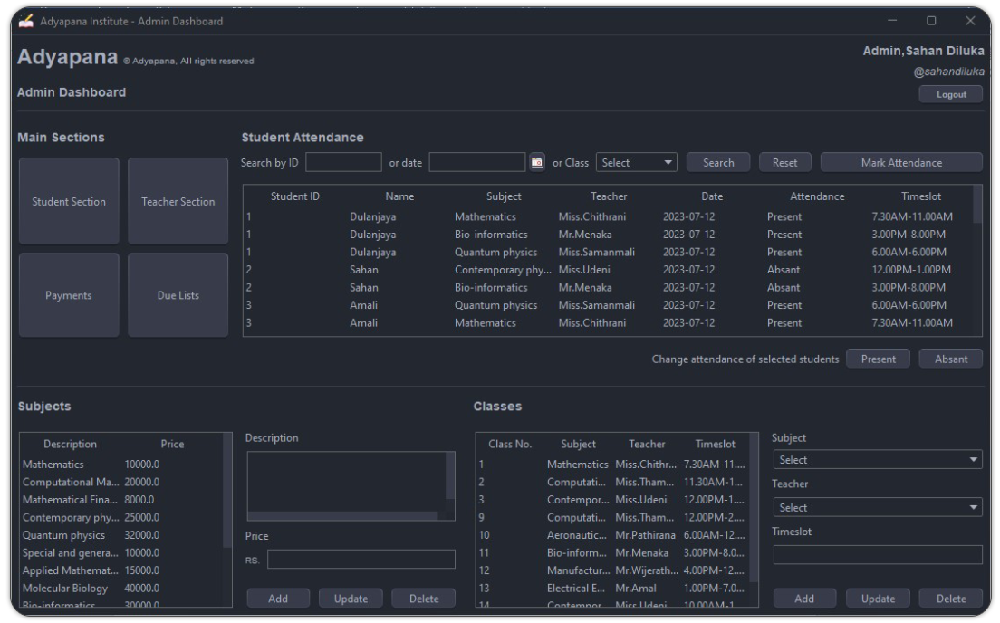

<br/>
<div align="center">
<a href="https://github.com/dulanjayabhanu/Adyapana/">

</a>
<h3 align="center">Adyapana</h3>
<p align="center">
STAND ALONE STUDENT MANAGEMENT SYSTEM
<br/>
<br/>
<a href="https://github.com/dulanjayabhanu/Adyapana/"><strong>Explore the docs »</strong></a>
<br/>
<br/>
<a href="https://github.com/dulanjayabhanu/Adyapana/">View Repo .</a>  
<a href="https://github.com/dulanjayabhanu/Adyapana/issues/new?labels=bug&amp;template=bug_report.md">Report Bug .</a>
<a href="https://github.com/dulanjayabhanu/Adyapana/issues/new?labels=enhancement&amp;&template=feature_request.md">Request Feature</a>
</p>
</div>

  

## Table of Contents

- [📖 Introduction](#introduction)
- [✨ Features](#features)
- [⚙️ Installation](#installation)
- [🚀 Usage](#usage)
- [🤝 Contributing](#contributing)
- [📜 License](#license)
- [📞 Contact](#contact)

## Introduction

**Adyapana** is a standalone student management system designed for students who have completed their Advanced Levels in the Science stream. This web application facilitates efficient management of various processes at the institute, which has more than 2500 students.

<div>
  
</div>

## Features

- **📋 Student Registration**: Register new students with ease.
- **📚 Subject Registration**: Enroll students in their desired subjects.
- **👩‍🏫👨‍🏫 Teacher Enrolment**: Manage teacher registrations and assignments.
- **💳 Student Payment**: Handle student payments efficiently.
- **🏫 Class Registration**: Organize and manage class schedules.
- **👨‍🎓👩‍🎓 Student and Teacher Enrolment for Subjects**: Enroll students and teachers in specific subjects.
- **📅 Student Attendance**: Track and view student attendance for each class.
- **📑 Due Reports**: Generate and view reports on dues for all classes.

## Installation ⚙️

1. Clone the repository:
   ```bash
   git clone https://github.com/yourusername/adyapana.git
2. Navigate to the project directory:
   ```bash
   cd adyapana
3. Install dependencies:
    ```bash
   npm install
4. Start the application:
    ```bash
   npm start

## Usage 🚀

After setting up the application, navigate to `http://localhost/Adyapana` in your web browser. Use the provided interface to manage student and teacher enrolments, subject registrations, payments, attendance, and more.

### Admin Guide 👨‍💼

- **📋 Student Registration**: Register new students.
- **📚 Subject Registration**: Enroll students in subjects.
- **👩‍🏫 Teacher Enrolment**: Manage teacher assignments.
- **💳 Student Payment**: Handle payments and generate invoices.
- **🏫 Class Registration**: Organize class schedules.
- **👨‍🎓👩‍🎓 Student and Teacher Enrolment for Subjects**: Manage enrolment for subjects.
- **📅 Student Attendance**: Track and view attendance.
- **📑 Due Reports**: Generate and view due reports.

## Contributing 🤝

We welcome contributions! Please follow these steps:

1. Fork the repository.
2. Create a new branch:
   ```bash
   git checkout -b feature-branch
3. Make your changes and commit them:
   ```bash
   git commit -m "Description of your changes"
4. Push to the branch:
    ```bash
   git push origin feature-branch
5. Create a pull request.

## License 📜

This project is licensed under the MIT License. See the [LICENSE](LICENSE) file for details.

## Contact 📞

For any inquiries or feedback, please contact:

- **Email**: [dulanjayawebs@gmail.com]

Thank you for using Adyapana! We hope this application helps streamline the management processes at your institute. 🎒
